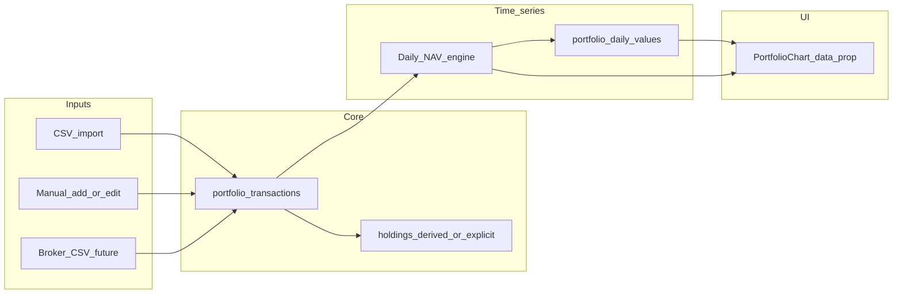

# Portfolio transaction history and value time series

## Does this make sense?

Yes. **“Portfolio value” over time is NAV (mark-to-market positions + cash) on each day.** Your UI already computes **today’s** total from live quotes plus [`portfolio-detail.tsx`](apps/web/src/routes/portfolio-detail.tsx) holdings and cash, but the chart in [`portfolio-chart.tsx`](apps/web/src/components/portfolio-chart.tsx) still falls back to [`DEFAULT_DATA`](apps/web/src/components/portfolio-chart.tsx) because [`portfolio-detail.tsx`](apps/web/src/routes/portfolio-detail.tsx) renders `<PortfolioChart />` with **no `data` prop** (grep shows a single usage with no props).

Without **cash flows and position changes over time**, you cannot know how many shares you held on past dates, so you cannot honestly chart past portfolio value from **current** holdings alone. Importing **transaction history** (or at least buys/sells + cash movements) is the right prerequisite; optional **daily snapshots** avoid recomputing the entire history on every page load.

## Current state (relevant facts)

- **Schema:** [`supabase/migrations/20260416163539_1470608e-892e-4e86-ab52-7c1275847997.sql`](supabase/migrations/20260416163539_1470608e-892e-4e86-ab52-7c1275847997.sql) has `portfolios` and `holdings` (lots: ticker, purchase_date, purchase_price, quantity, fees). There is **no** transactions or daily-value table in repo migrations.
- **CSV import:** [`create-csv-modal.tsx`](apps/web/src/components/create-csv-modal.tsx) inserts **one holding row per CSV row** (treated as a buy lot), not a separate ledger. That is enough to **infer** past positions **if** every row is a buy and you never sell (MVP assumption).
- **Prices:** [`apps/api/src/index.ts`](apps/api/src/index.ts) already calls Yahoo chart (`v8/finance/chart`) with `period1` / `period2` / `interval=1d` for things like `getYtdChangePercent` — the same pattern can fetch **historical closes** per ticker for backfill (watch rate limits and null closes on non-trading days).

## Recommended architecture

**Source of truth:** `portfolio_transactions` (append-only rows: type, `occurred_at` date/time, ticker optional, quantity, price, fees, cash delta, optional `external_id` / raw payload for idempotent imports).

**Derived state for the table UI:** Keep `holdings` as **materialized open lots** (what you already show), updated whenever transactions change — or derive lots in the app from transactions only (cleaner long-term, larger refactor). **Pragmatic v1:** write transactions **and** keep holdings in sync the way you do today (CSV → lots; new “Add holding” → BUY transaction + lot).

**Chart series:** Prefer a **`portfolio_daily_values`** table: `(portfolio_id, date, total_value, cash_value, positions_value, optional json breakdown)` with a **unique constraint** on `(portfolio_id, date)`. The chart reads ordered rows; lightweight-charts already expects `{ time, value }` in [`portfolio-chart.tsx`](apps/web/src/components/portfolio-chart.tsx).

## Historical NAV computation (backfill)

For each calendar day `D` from `min(transaction_date)` through today:

1. **Replay ledger** to get shares held per ticker and cash balance at end of `D` (or start of next day — pick one convention and stick to it).
2. For each ticker with `shares > 0`, fetch historical **adjusted** daily close for `D` from Yahoo (or store closes in your DB later if you hit rate limits). Multiply `shares * close`, sum, add cash.
3. Write/update `portfolio_daily_values` for `D`.

**Edge cases to document in code (not all need v1):** corporate actions (adjusted close helps), missing price days (forward-fill last close), multi-currency (assume USD v1), partial-day transactions (use date-only), sells and shorting (needs SELL rows in ledger).

## “Holdings already exist” — how value gets recorded

Three complementary behaviors:

1. **Backfill from existing lots:** One-time migration script or API: emit a **synthetic `BUY` transaction** per existing `holdings` row (date = `purchase_date`, qty, price, fees) so the ledger matches reality for accounts that only ever bought via your app/CSV.
2. **Ongoing updates:** After any mutation (add/edit/delete holding, cash update, future import), **invalidate** daily values from `min(affected_date)` forward and **recompute** that tail (or enqueue a job). For scale, recompute only last N days on write and full history on import.
3. **Rolling forward:** Use the existing Worker **cron** in [`apps/api/wrangler.toml`](apps/api/wrangler.toml) / [`scheduled` handler](apps/api/src/index.ts) to once per day: for each portfolio with auto-snapshot enabled, append **today’s** row using **end-of-day closes** (or “last known” if market open — product choice).

If users have **no** history before first use, the chart honestly **starts** at first transaction date unless they import older data or you add a **manual “NAV override”** CSV (optional stretch).

## Import (crucial for the chart)

- **Extend CSV format** (or add a second template): `Action` (`BUY`/`SELL`/`DEPOSIT`/`WITHDRAW`/`DIVIDEND`/`FEE`), `Date`, `Ticker`, `Quantity`, `Price`, `Fees`, `CashAmount` where relevant.
- **Idempotency:** Hash row or broker `transaction_id` column to skip duplicates on re-import.
- **New flow:** “Import into existing portfolio” vs only “create new portfolio” — new UI entry on [`portfolio-detail.tsx`](apps/web/src/routes/portfolio-detail.tsx) in addition to [`create-csv-modal.tsx`](apps/web/src/components/create-csv-modal.tsx).

## API surface (suggested)

- `POST /api/portfolios/:id/transactions/import` — parse CSV, validate, insert in a transaction (DB).
- `POST /api/portfolios/:id/valuation/rebuild?from=YYYY-MM-DD` — recompute `portfolio_daily_values` (auth + ownership check; same Supabase service pattern as other routes in [`apps/api/src/index.ts`](apps/api/src/index.ts)).
- `GET /api/portfolios/:id/valuation/daily?from=&to=` — return points for the chart (read from table; if empty, optionally trigger lazy rebuild).

## Frontend

- Load daily points in [`portfolio-detail.tsx`](apps/web/src/routes/portfolio-detail.tsx) and pass `data` into `PortfolioChart` (map `date` → `time` string format lightweight-charts accepts).
- Empty state: show “Import transactions to see history” instead of [`DEFAULT_DATA`](apps/web/src/components/portfolio-chart.tsx) once the portfolio is real (or remove default when `portfolioId` is set).

## Schema / types / RLS

- New migration(s): `portfolio_transactions`, `portfolio_daily_values`, indexes on `(portfolio_id, occurred_at)` and `(portfolio_id, date)`.
- RLS mirroring holdings: only owners of `portfolios` can read/write child rows.
- Regenerate [`apps/web/src/integrations/supabase/types.ts`](apps/web/src/integrations/supabase/types.ts) after migration (note: UI references `cash_value` on portfolios while generated types in repo may be stale — align migrations and types when touching this area).

## Phased delivery (suggested)

1. **MVP:** `BUY` + cash deposits/withdrawals only; synthetic backfill from current `holdings`; daily table + rebuild endpoint; wire chart; CSV import into existing portfolio.
2. **v2:** `SELL`, dividends, fees; lot matching (FIFO); better handling of Yahoo limits (batch symbols, cache closes in `symbol_daily_prices`).

## Risks / constraints

- Yahoo usage limits and reliability — consider caching per-symbol daily closes in Supabase if rebuilds get heavy.
- **Sell** semantics require either negative lots (not ideal) or **transactions + derived lots**; plan for sells before promising full broker parity.
